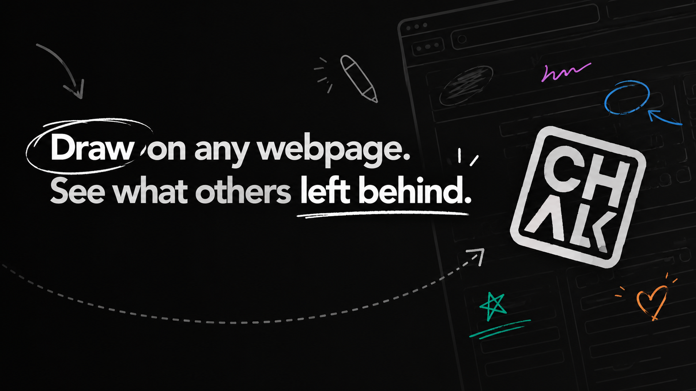

# Chalk

Draw on any webpage. See what others left behind.

Chalk is a Chrome extension that layers a shared drawing canvas over any website. Leave freehand strokes, text, and color on top of any page — and see what others have left behind on the same URL.

## How it works

1. Install Chalk and visit any webpage
2. Click the Chalk icon in your toolbar to activate the overlay
3. Pick a color and brush size, then draw directly on the page
4. Close Chalk — your marks are saved
5. Anyone else with Chalk installed will see what you drew when they visit the same URL

## Features

- Freehand brush with three sizes and a 6-color palette
- Text tool — click anywhere to type
- Shared across all users by URL — it's collaborative graffiti
- Anonymous by default, no account required
- Keyboard shortcuts for everything (P, T, Esc, 1–6)

## Status

Early alpha. See [CHANGELOG.md](CHANGELOG.md) for what's shipped.
